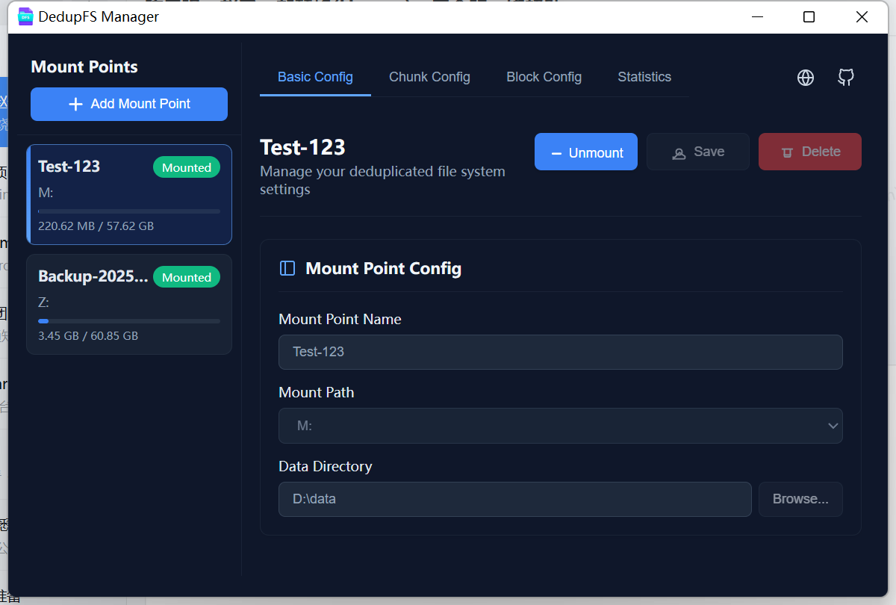
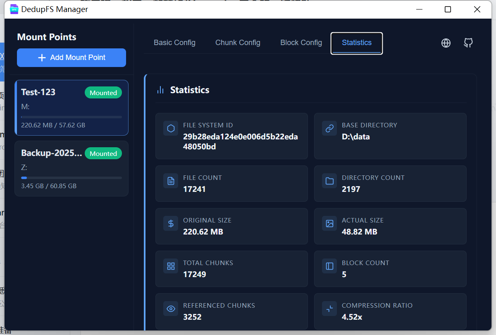
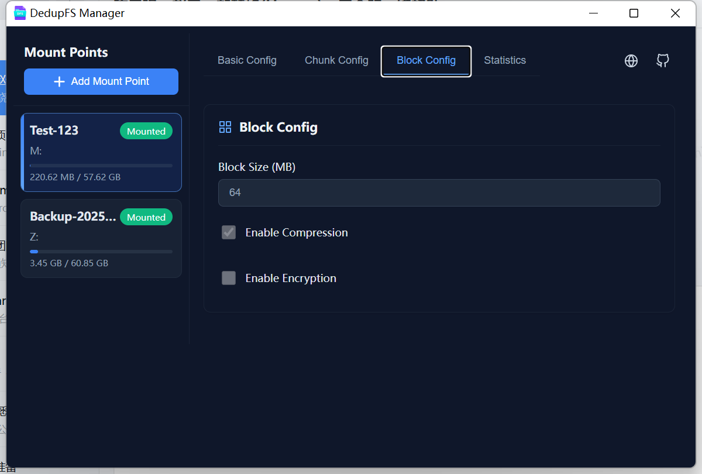
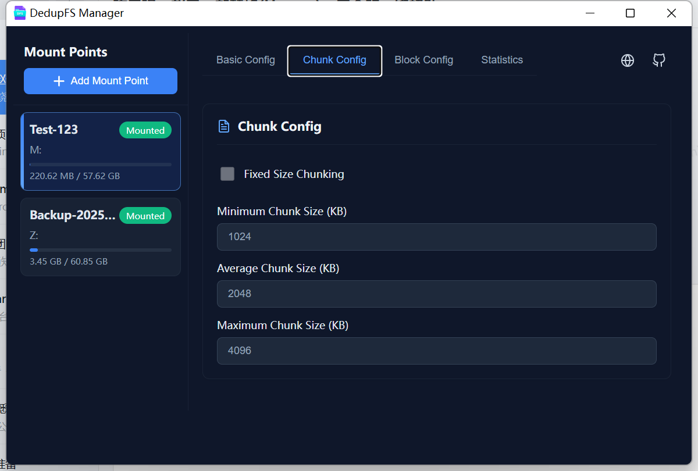
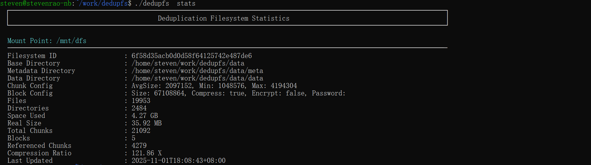

# DedupFS - Deduplication File System

[English](./README.md) | [中文](./README_ZH.md)

[](https://www.gnu.org/licenses/gpl-3.0)


## Project Introduction

DedupFS is an innovative deduplication and compression file system that transparently implements content-aware data deduplication and compression in user space, providing significant storage space savings for storage-intensive applications. It is compatible with standard file system interfaces, allowing users to enjoy storage optimization benefits without modifying existing applications.

## Core Values

- **Dual-Layer Deduplication Strategy**: Unique combination of intra-file chunk deduplication and global cross-file deduplication to comprehensively eliminate redundant data
- **Storage Efficiency Revolution**: Achieve dozens of times storage space savings through advanced content chunking and similarity aggregation technologies
- **Performance and Efficiency Balance**: Minimize I/O performance impact while ensuring deduplication effectiveness
- **Completely Transparent Usage**: Provides standard POSIX file system interface, no modifications required for existing applications
- **Data Security Guarantee**: Built-in integrity verification and transaction protection to ensure data security and reliability

## Technical Highlights

### 🧠 Intelligent Content Chunking

```go
// FastCDC-based variable-length chunking algorithm
type FastCDCChunker struct {
    minSize int // 8KB minimum chunk
    avgSize int // 32KB average chunk  
    maxSize int // 128KB maximum chunk
}
```

**Technical Advantages**:
- **Content-Defined Chunking**: Chunk boundaries based on content features, not fixed positions
- **Variable Chunk Sizes**: Adaptively adjust chunk sizes to optimize deduplication effectiveness
- **High Throughput Processing**: Single-threaded processing speed up to 2GB/s

### 🔍 Double-Layer Deduplication Technology

```go
// SHA-256 based global deduplication
type DedupEngine struct {
    // Implementation details
}

func (de *DedupEngine) FindDuplicates(chunks []*Chunk) []*ChunkRef {
    // Intra-file duplicate chunk detection
    // Global hash index lookup
    // Cross-file, cross-directory duplicate data identification
    return nil
}
```

**Double-Layer Deduplication Advantages**:
- **Intra-File Deduplication**: Identify and eliminate duplicate data blocks within a single file
- **Inter-File Deduplication**: Global duplicate data detection across all files and directories
- **Cryptographic Hash**: SHA-256 ensures data uniqueness with extremely low collision probability
- **Real-time Deduplication**: Instant detection and elimination of duplicate data during writing
- **Intelligent Merging**: Only one copy of identical data blocks is retained at the storage layer, maximizing space savings

### 🗜️ Dual-Layer Compression Technology

```go
// Similar block aggregation compression
type CompressionEngine struct {
    // Implementation details
}

func (ce *CompressionEngine) CompressBlocks(similarChunks []*Chunk) *CompressedBlock {
    // Single chunk compression processing
    // Similar content aggregation followed by unified compression
    // Utilize data locality to improve compression ratio
    return nil
}
```

**Dual-Layer Compression Advantages**:
- **Chunk-Level Compression**: Basic compression for individual data blocks
- **Similarity Aggregation Compression**: Reorganize similar chunks into blocks for secondary compression
- **Zstandard Algorithm**: Perfect balance of high compression ratio and fast decompression
- **Adaptive Compression Levels**: Intelligently select compression strategies based on data type
- **Multi-Level Compression**: Dual compression strategy achieves higher compression ratios than single compression methods

### ⚡ High-Performance Architecture

```go
// Multi-level cache system
type CacheManager struct {
    chunkCache    *LRUCache[ChunkHash, []byte]    // Hot data block cache
    blockCache    *LRUCache[BlockId, []byte]      // Decompressed block cache
    inodeCache    *Cache[ino, INode]              // Inode cache
}
```

**Performance Optimizations**:
- **Three-Level Cache System**: Memory, block, and metadata multi-level caching
- **Asynchronous I/O Pipeline**: Parallel processing of chunking, hashing, and compression operations
- **Batch Operation Optimization**: Reduce system overhead for small file operations

## System Architecture

### Layered Design

```
┌─────────────────────────────────────────┐
│             Application Layer           │
│        (Standard File Operation API)    │
└─────────────────────┬───────────────────┘
┌─────────────────────────────────────────┐
│           File System Interface Layer   │
│  ┌─────────────┬─────────────┐         │
│  │   FUSE      │   WinFsp    │         │
│  │  (Linux)    │  (Windows)  │         │
│  └─────────────┴─────────────┘         │
└─────────────────────┬───────────────────┘
┌─────────────────────────────────────────┐
│           DedupFS Core Engine           │
│  ┌───────────┐  ┌───────────┐          │
│  │ Chunking  │  │ Dedup     │          │
│  │  Service  │  │  Engine   │          │
│  └───────────┘  └───────────┘          │
│  ┌───────────┐  ┌───────────┐          │
│  │Compression│  │  Cache    │          │
│  │  Engine   │  │ Management│          │
│  └───────────┘  └───────────┘          │
└─────────────────────┬───────────────────┘
┌─────────────────────────────────────────┐
│            Storage Abstraction Layer    │
│  ┌───────────┐  ┌───────────┐          │
│  │Metadata   │  │ Block     │          │
│  │Storage    │  │ Storage   │          │
│  │(pebbledb) │  │(File Sys) │          │
│  └───────────┘  └───────────┘          │
└─────────────────────────────────────────┘
```

### Data Flow Design

#### Write Path
```
Application write request
        ↓
FUSE/WinFsp interface layer
        ↓
FastCDC variable-length chunking → [8KB-128KB data blocks]
        ↓
SHA-256 hash calculation → [Global duplicate detection]
        ↓
Similar block aggregation → [64MB compressed blocks]
        ↓
Zstandard compression → [High compression ratio storage]
        ↓
Metadata update → [RocksDB transaction]
```

#### Read Path
```
Application read request
        ↓
FUSE/WinFsp interface layer  
        ↓
Metadata query → [Block location resolution]
        ↓
Parallel block reading → [Cache priority]
        ↓
Zstandard decompression → [Memory decompression]
        ↓
Data reassembly → [Transparent return]
```

## Application Scenarios

### 🖥️ Development Environment
- **Code Repository Storage**: Deduplication of common library files between multiple projects
- **Docker Image Storage**: Elimination of duplicates in base image layers
- **Build Cache Optimization**: Intelligent deduplication of compilation intermediate files

### 💽 Data Backup
- **Virtual Machine Images**: Storage optimization of similar operating system images
- **Database Backups**: Efficient storage of incremental backup data
- **Document Version Repositories**: Storage compression of similar document versions

### ☁️ Cloud-Native Applications
- **Container Persistent Storage**: Storage efficiency improvement for stateful applications
- **AI/ML Data Lakes**: Intelligent compression of training datasets
- **Log Storage Systems**: Elimination of repetitive patterns in structured logs

## Screenshots

### Linux / Windows

<!-- tabs:start -->

#### ** Linux **

##### Debug Tools Interface

**Block Debug Interface**


**Inode Debug Interface**


#### ** Windows **

##### Main Interface



##### Statistics Interface



##### Block Management Interface



##### Chunk Interface



##### Debug Tools Interface

**Block Debug Interface**


**Inode Debug Interface**


<!-- tabs:end -->

## Quick Start

### Linux / Windows

<!-- tabs:start -->

#### ** Linux **

##### Installation

```bash
# Compile from source
git clone https://github.com/your-username/dedupfs.git
cd dedupfs
go build -o dedupfs main.go
```

##### Basic Usage

```bash
# Start dedupfs server (server must be started before mounting filesystem)
./dedupfs server start

# Mount deduplication filesystem
./dedupfs mount /mnt/dfs data/ --min-size=1048576 --avg-size=2097152 --max-size=4194304 --compress=true

# Use the filesystem normally
cp large_file.iso /mnt/dfs/
ls -lh /mnt/dfs/

# Check deduplication effectiveness
./dedupfs stats

# Unmount the filesystem
./dedupfs unmount /mnt/dfs

# Stop dedupfs server
./dedupfs server stop

# Debug commands
# Debug block information
./dedupfs debug /mnt/dfs block blockID

# Debug inode information
./dedupfs debug /mnt/dfs inode file.txt
```

#### ** Windows **

##### Installation

Download or compile from source to generate `dedupfs.exe` and `dedupfs-cli.exe` executable files.

##### Basic Usage

Double-click `dedupfs.exe` to launch the graphical interface, or use command line:

```powershell
# Start dedupfs server
dedupfs server start

# Mount deduplication filesystem
./dedupfs mount X:\ data\ --min-size=1048576 --avg-size=2097152 --max-size=4194304 --compress=true

# Use the filesystem normally
copy large_file.iso X:\
dir X:\

# Check deduplication effectiveness
./dedupfs stats

# Unmount the filesystem
./dedupfs unmount X:\

# Stop dedupfs server
./dedupfs server stop
```

<!-- tabs:end -->


### Advanced Configuration

All configuration parameters are now provided via command line arguments. To get a complete list of available options, run:

```bash
./dedupfs --help
./dedupfs mount --help
./dedupfs debug --help
./dedupfs server --help
```

Common parameters:
- `--avg-size`:      Average chunk size in bytes, default 2097152 (2MB)
- `--max-size`:      Maximum chunk size in bytes, default 4194304 (4MB)
- `--min-size`:      Minimum chunk size in bytes, default 1048576 (1MB)
- `--block-size`:    Block size in bytes, default 67108864 (64MB)
- `--fixed-size`:    Use fixed size chunks, default false
- `--compress`:      Enable compression, default true
- `--encrypt`:       Enable encryption, default false
- `--password`:      Encryption password (empty string by default)

Log level control:
- `-v`:   Warning level logs
- `-vv`:  Info level logs
- `-vvv`: Debug level logs
- `-vvvv`: Trace level logs

### Server Management

DedupFS uses a server-client architecture; you must start the server before mounting the filesystem:

```bash
# Start the server
./dedupfs server start

# Stop the server
./dedupfs server stop
```

The server will handle all mount, unmount, and stats commands. When the server receives a termination signal, it automatically cleans up all mount points.

### Debug Tools

DedupFS includes powerful debug tools for examining internal structures:

#### Block Debug

The `debug block` command allows you to inspect detailed information about blocks, including chunks, compression status, and data layout.


#### Inode Debug


The `debug inode` command provides detailed information about file inodes, their chunks, and metadata.

Both debug interfaces feature:
- Interactive chunk browsing
- Hexadecimal view of chunk contents
- Real-time reference counting
- Comprehensive metadata display

## Performance

### Storage Efficiency Benchmarks

| Data Type | Original Size | DedupFS Size | Space Saved | Deduplication Ratio | Compression Ratio |
|-----------|--------------|--------------|-------------|---------------------|-------------------|
| Linux Kernel Source | 1.8 GB | 412 MB | 77% | 3.2:1 | 1.4:1 |
| VM Image Collection | 45 GB | 14 GB | 69% | 2.8:1 | 1.6:1 |
| Code Repository Backup | 12 GB | 2.8 GB | 77% | 3.5:1 | 1.4:1 |
| Document and Image Library | 8.3 GB | 3.1 GB | 63% | 1.8:1 | 2.1:1 |

### I/O Performance Comparison

| Workload | Native Filesystem | DedupFS | Performance Overhead |
|----------|-------------------|---------|----------------------|
| Large File Sequential Write | 450 MB/s | 320 MB/s | 29% |
| Large File Sequential Read | 480 MB/s | 410 MB/s | 15% |
| Small File Random Read | 380 MB/s | 340 MB/s | 11% |
| Metadata Operations | 85k ops/s | 72k ops/s | 15% |

## Advantages Over ZFS

| Dimension | **DedupFS (based on FUSE + Badger/Pebble)** | **ZFS (with dedup)** | **DedupFS Advantage Description** |
|-----------|---------------------------------------------|---------------------|------------------------------------|
| **Deduplication Granularity** | ✅ **Fine-grained** (supports fixed/variable chunking, e.g., 4KB–64KB) | ⚠️ **Coarse-grained** (by recordsize, default 128KB) | Higher deduplication efficiency for similar files (logs, VM images, document versions); ZFS may fail to deduplicate entire blocks due to single-byte differences |
| **Memory Overhead** | ✅ **Low and controllable** (fingerprint index stored in Badger, can be persisted, memory usage ≈ hundreds of MB) | ❌ **Extremely high** (dedup table DDT must reside in memory, 1TB data ≈ 5–10GB RAM) | DedupFS can run on low-memory devices (NAS, Raspberry Pi); ZFS dedup performance crashes with insufficient memory |
| **Kernel Module Required** | ❌ **No** (only depends on standard FUSE interface) | ✅ **Yes** (requires loading `zfs.ko` kernel modules) | DedupFS can be deployed by regular users, no root required; ZFS needs system administrator privileges |
| **Deployment Complexity** | ✅ **Extremely low** (single binary + FUSE) | ⚠️ **Medium-high** (requires zfsutils installation, zpool creation, formatting) | DedupFS suitable for desktop, edge, container environments; ZFS suitable for dedicated storage servers |
| **Cross-Platform Support** | ✅ **Linux / macOS / Windows (via WinFsp)** | ❌ **Linux / FreeBSD only** | DedupFS can be used as a universal backup/sync tool; ZFS not available for macOS or regular Windows users |
| **Deduplication Strategy Flexibility** | ✅ **Highly customizable** (variable-length chunking, content-aware, encryption-compatible design) | ❌ **Fixed strategy** (only based on record hash, cannot sense content) | DedupFS can optimize for specific workloads (database backups, video frames); ZFS cannot adapt to application logic |
| **Application Integration Capability** | ✅ **Strong** (can be embedded in backup tools, cloud clients, CLI tools) | ❌ **Weak** (only as underlying storage, cannot expose dedup metadata) | DedupFS can implement "only transfer new chunks", "versioned snapshots" and other advanced features; ZFS cannot provide chunk-level API |
| **Backup and Recovery** | ✅ **Built-in streaming backup** (Pebble `Backup()` supports incremental, single-file) | ⚠️ **Relies on snapshots + manual copying** (no application-level consistency guarantee) | DedupFS can directly export logical backups; ZFS snapshots are physical-level and cannot be restored across platforms |
| **Encryption Compatibility** | ✅ **Supports "chunk before encryption"** (preserves dedup capability) | ❌ **Incompatible** (ZFS cannot dedup if encryption is applied first) | DedupFS achieves both **security + deduplication**; ZFS dedup and encryption are mutually exclusive |
| **Applicable Data Scale** | ✅ **From small files to PB level** (index can be persisted) | ⚠️ **Only suitable for small scale** (memory-limited, >10TB high risk) | DedupFS better suited for long-term growing backup repositories; ZFS dedup unsustainable with large data volumes |
| **Development and Debugging** | ✅ **User-space, crashes don't affect system** | ❌ **Kernel-space, bugs may cause panic** | DedupFS safer and easier to iterate; ZFS debugging requires kernel knowledge |

## Technical Advantages

### 🔬 Content-Aware Technology

Unlike traditional fixed-size chunk deduplication, DedupFS employs content-defined variable-length chunking that can:

- **Adapt to Data Patterns**: Intelligently adjust chunk boundaries based on content features
- **Resist Data Shifting**: Data insertion and deletion do not affect deduplication effectiveness of existing chunks
- **Optimize Duplicate Detection**: Improve cross-file duplicate data recognition rate

### 🛡️ Data Security Guarantee

- **End-to-End Verification**: SHA-256 hash ensures data integrity
- **Transactional Metadata**: RocksDB guarantees metadata operation consistency
- **Crash Recovery**: Atomicity of write operations ensures system reliability

### 🌉 Cross-Platform Compatibility

- **Linux FUSE**: Complete POSIX compatibility
- **Windows WinFsp**: Native Windows integration experience
- **Unified Data Format**: Cross-platform data sharing and migration

## Core API

### Command Line Interface

DedupFS provides a comprehensive command line interface for all operations. All parameters are specified via command line arguments, facilitating integration with scripts and automated workflows.

Available commands include:

```bash
- `mount`: Mount deduplication filesystem
- `unmount`/`umount`: Unmount filesystem
- `stats`: Display statistics for all mounted filesystems
- `debug`: Advanced debugging tools (block, inode)
- `server`: Manage dedupfs server (start, stop)
- `restore`: Restore data from dedupfs to target path
```

For detailed command usage, refer to command help or source code in the `cmd` directory:

```bash
./dedupfs help
./dedupfs [command] --help
```

## Frequently Asked Questions

### ❓ How is data security ensured?

DedupFS employs multi-layered integrity protection:
- All data blocks are verified using SHA-256 checksums
- Metadata operations are guaranteed consistent through RocksDB transactions
- Crashes during writing do not cause data corruption

### ❓ What's the performance impact?

Under typical workloads:
- Write performance reduced by 20-30%, in exchange for 60-80% storage space savings
- Read performance impact less than 15%, hot data approaches native performance
- Memory overhead approximately 100MB, adjustable based on system configuration

### ❓ Which scenarios are supported?

Particularly suitable for:
- **Backup data**: Backup data has a lot of similarities with duplication rates above 90%. Very suitable for dedupfs.
- **Storage data**: System images, virtual machine images, docker images, database raw data, code repositories, and text documents. These data have high compression ratios and content deduplication rates.
- **Incremental data processing**: When you're worried about how to perform incremental backups and design version number management for data. dedupfs can easily solve this. You can copy data in full, and dedupfs has already deduplicated duplicate data at the underlying level, without occupying any additional storage space.

## Get Started

DedupFS makes storage efficiency improvement simple and straightforward. Just use your preferred command line parameters to mount the filesystem to enjoy storage space savings from intelligent deduplication and compression.

```bash
# Start the server
./dedupfs server start

# Mount the filesystem
./dedupfs mount /path/to/mountpoint /path/to/data

# Use debug tools to examine internal structure
./dedupfs debug /path/to/mountpoint block blockID
./dedupfs debug /path/to/mountpoint inode file.txt
```

```bash
# Unmount and stop server when finished
./dedupfs unmount /path/to/mountpoint
./dedupfs server stop

# Restore data from dedupfs to target path
./dedupfs restore /path/to/data /path/to/restore/target

# Start enjoying intelligent storage optimization!
```

## License

This project is licensed under GPL 3 - see the [LICENSE](LICENSE) file for details.

## Contributing

Contributions are welcome! Please see [CONTRIBUTING.md](CONTRIBUTING.md) for contribution guidelines.

---

**DedupFS** - Intelligent deduplication and compression, making storage more efficient!