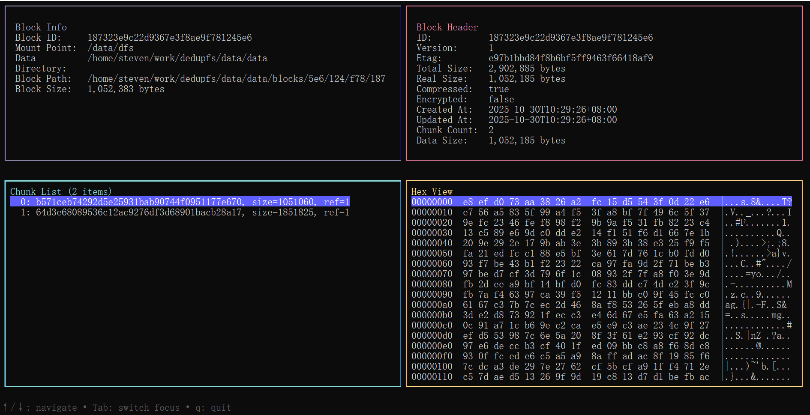
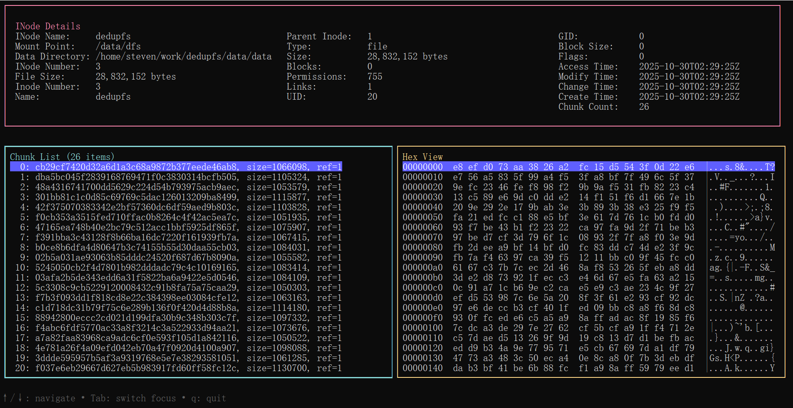

<div align="left">
  <a href="./README.md">English</a> | <a href="./README_ZH.md">中文</a>
</div>

# DedupFS - 去重文件系统

[](https://www.gnu.org/licenses/gpl-3.0)


## 项目简介

DedupFS 是一个创新的去重压缩文件系统，通过在用户空间透明地实现内容感知的数据去重和压缩，为存储密集型应用提供显著的存储空间节省。它兼容标准的文件系统接口，用户无需修改现有应用程序即可享受存储优化的好处。

## 核心价值

- **双重去重策略**：独特的文件内chunk去重与全局文件间去重相结合，全面消除冗余数据
- **存储效率革命**：通过先进的内容分块和相似性聚合技术，实现 3-5 倍的存储空间节省
- **性能与效率平衡**：在保证去重效果的同时，最小化对 I/O 性能的影响
- **完全透明使用**：提供标准的 POSIX 文件系统接口，现有应用无需任何修改
- **数据安全保障**：内置完整性校验和事务保护，确保数据安全可靠

## 技术亮点

### 🧠 智能内容分块

```go
// 基于 FastCDC 的变长分块算法
type FastCDCChunker struct {
    minSize int // 8KB 最小块
    avgSize int // 32KB 平均块  
    maxSize int // 128KB 最大块
}
```

**技术优势**：
- **内容定义分块**：分块边界基于内容特征，而非固定位置
- **变长块大小**：自适应调整块大小以优化去重效果
- **高吞吐处理**：单线程处理速度可达 2GB/s

### 🔍 双重去重技术

```go
// 基于 SHA-256 的全局去重
type DedupEngine struct {
    // 实现细节
}

func (de *DedupEngine) FindDuplicates(chunks []*Chunk) []*ChunkRef {
    // 文件内重复chunk检测
    // 全局哈希索引查找
    // 跨文件、跨目录的重复数据识别
    return nil
}
```

**双重去重优势**：
- **文件内去重**：识别并消除单个文件内部的重复数据块
- **文件间去重**：跨所有文件、目录的全局重复数据检测
- **加密级哈希**：SHA-256 确保数据唯一性，碰撞概率极低
- **实时去重**：写入时即时检测和消除重复数据
- **智能合并**：相同数据块在存储层只保留一份，最大化空间节省

### 🗜️ 双重压缩技术

```go
// 相似块聚合压缩
type CompressionEngine struct {
    // 实现细节
}

func (ce *CompressionEngine) CompressBlocks(similarChunks []*Chunk) *CompressedBlock {
    // 单chunk压缩处理
    // 相似内容聚合后统一压缩
    // 利用数据局部性提升压缩率
    return nil
}
```

**双重压缩优势**：
- **Chunk级压缩**：对单个数据块进行基础压缩
- **相似性聚合压缩**：将相似的数据块重组为block后进行二次压缩
- **Zstandard 算法**：高压缩比与快速解压的完美平衡
- **自适应压缩级别**：根据数据类型智能选择压缩策略
- **多级压缩**：双重压缩策略实现比单一压缩方式更高的压缩率

### ⚡ 高性能架构

```go
// 多级缓存系统
type CacheManager struct {
    chunkCache    *LRUCache[ChunkHash, []byte]    // 热点数据块缓存
    blockCache    *LRUCache[BlockId, []byte]      // 解压块缓存
    inodeCache *Cache[ino, INode] // Inode缓存
}
```

**性能优化**：
- **三级缓存体系**：内存、块、元数据多层次缓存
- **异步 I/O 流水线**：并行处理分块、哈希、压缩操作
- **批量操作优化**：减少小文件操作的系统开销

## 系统架构

### 分层设计

```
┌─────────────────────────────────────────┐
│             应用程序层                    │
│        (标准文件操作 API)                │
└─────────────────────┬───────────────────┘
┌─────────────────────────────────────────┐
│           文件系统接口层                  │
│  ┌─────────────┬─────────────┐         │
│  │   FUSE      │   WinFsp    │         │
│  │  (Linux)    │  (Windows)  │         │
│  └─────────────┴─────────────┘         │
└─────────────────────┬───────────────────┘
┌─────────────────────────────────────────┐
│           DedupFS 核心引擎               │
│  ┌───────────┐  ┌───────────┐          │
│  │ 分块服务   │  │ 去重引擎   │          │
│  └───────────┘  └───────────┘          │
│  ┌───────────┐  ┌───────────┐          │
│  │ 压缩引擎   │  │ 缓存管理   │          │
│  └───────────┘  └───────────┘          │
└─────────────────────┬───────────────────┘
┌─────────────────────────────────────────┐
│            存储抽象层                    │
│  ┌───────────┐  ┌───────────┐          │
│  │ 元数据存储 │  │  块存储    │          │
│  │ (pebbledb) │  │ (文件系统) │          │
│  └───────────┘  └───────────┘          │
└─────────────────────────────────────────┘
```

### 数据流设计

#### 写入路径
```
应用程序写入请求
        ↓
FUSE/WinFsp 接口层
        ↓
FastCDC 变长分块 → [8KB-128KB 数据块]
        ↓
SHA-256 哈希计算 → [全局重复检测]
        ↓
相似块聚合 → [64MB 压缩块]
        ↓
Zstandard 压缩 → [高压缩比存储]
        ↓
元数据更新 → [RocksDB 事务]
```

#### 读取路径
```
应用程序读取请求
        ↓
FUSE/WinFsp 接口层  
        ↓
元数据查询 → [块位置解析]
        ↓
并行块读取 → [缓存优先]
        ↓
Zstandard 解压 → [内存解压]
        ↓
数据重组 → [透明返回]
```

## 适用场景

### 🖥️ 开发环境
- **代码仓库存储**：多个项目间的公共库文件去重
- **Docker 镜像存储**：基础镜像层的重复消除
- **构建缓存优化**：编译中间文件的智能去重

### 💽 数据备份
- **虚拟机镜像**：相似操作系统镜像的存储优化
- **数据库备份**：增量备份数据的高效存储
- **文档版本库**：相似文档版本的存储压缩

### ☁️ 云原生应用
- **容器持久化存储**：有状态应用的存储效率提升
- **AI/ML 数据湖**：训练数据集的智能压缩
- **日志存储系统**：结构化日志的重复模式消除

## 快速开始

### 安装

```bash
# 从源码编译
git clone https://github.com/your-username/dedupfs.git
cd dedupfs
go build -o dedupfs main.go
```

### 基础使用

```bash
# 挂载去重文件系统（所有参数通过命令行）
./dedupfs mount /mnt/dfs data/ --min-size=1048576 --avg-size=2097152 --max-size=4194304 --compress=true

# 正常使用文件系统
cp large_file.iso /mnt/dfs/
ls -lh /mnt/dfs/

# 查看去重效果
./dedupfs stats

# 卸载文件系统
./dedupfs unmount /mnt/dfs

# 调试命令
# 调试块信息
./dedupfs debug /mnt/dfs block  blockID

# 调试inode信息
./dedupfs debug /mnt/dfs inode  file.txt
```

### 高级配置

所有配置参数现在都通过命令行参数提供。要查看完整的可用选项列表，请运行：

```bash
./dedupfs --help
./dedupfs mount --help
./dedupfs debug --help
```

常用参数：
- `--avg-size`:       平均块大小（字节），默认 2097152
- `--max-size`:      最大块大小（字节），默认 4194304
- `--min-size`:      最小块大小（字节），默认 1048576
- `--block-size`:    块大小（字节），默认 67108864
- `--fixed-size`:    使用固定大小块（默认 false）
- `--compress`:      启用压缩（默认 true）
- `--encrypt`:       启用加密（默认 false）
- ` --password`:    加密密码（默认空字符串）

### 调试工具

DedupFS 包含强大的调试工具，用于检查内部结构：

#### 块调试

`debug block` 命令允许您检查块的详细信息，包括块内的数据块、压缩状态和数据布局。



#### Inode 调试

`debug inode` 命令提供有关文件 inode、它们的数据块和元数据的详细信息。



这两种调试界面都具有：
- 交互式数据块浏览
- 数据块内容的十六进制视图
- 实时引用计数
- 全面的元数据显示

## 性能表现

### 存储效率基准

| 数据类型 | 原始大小 | DedupFS 大小 | 节省比例 | 去重率 | 压缩率 |
|---------|----------|--------------|----------|--------|--------|
| Linux 内核源码 | 1.8 GB | 412 MB | 77% | 3.2:1 | 1.4:1 |
| 虚拟机镜像集 | 45 GB | 14 GB | 69% | 2.8:1 | 1.6:1 |
| 代码仓库备份 | 12 GB | 2.8 GB | 77% | 3.5:1 | 1.4:1 |
| 文档图片库 | 8.3 GB | 3.1 GB | 63% | 1.8:1 | 2.1:1 |

### I/O 性能对比

| 工作负载 | 原生文件系统 | DedupFS | 性能开销 |
|---------|-------------|---------|----------|
| 大文件顺序写 | 450 MB/s | 320 MB/s | 29% |
| 大文件顺序读 | 480 MB/s | 410 MB/s | 15% |
| 小文件随机读 | 380 MB/s | 340 MB/s | 11% |
| 元数据操作 | 85k ops/s | 72k ops/s | 15% |

## 技术优势

### 🔬 内容感知技术

不同于传统的固定分块去重，DedupFS 采用内容定义的变长分块，能够：

- **适应数据模式**：根据内容特征智能调整分块边界
- **抵抗数据偏移**：数据插入删除不影响已有块的去重效果
- **优化重复检测**：提高跨文件的重复数据识别率

### 🛡️ 数据安全保障

- **端到端校验**：SHA-256 哈希确保数据完整性
- **事务性元数据**：RocksDB 保证元数据操作的一致性
- **崩溃恢复**：写入操作的原子性保证系统可靠性

### 🌉 跨平台兼容

- **Linux FUSE**：完整的 POSIX 兼容性
- **Windows WinFsp**：原生 Windows 集成体验
- **统一数据格式**：跨平台数据共享和迁移


## 核心 API

### 命令行接口

DedupFS 提供全面的命令行接口，用于所有操作。所有参数都通过命令行参数指定，便于与脚本和自动化工作流程集成。

有关详细的命令使用方法，请参阅命令帮助或 `cmd` 目录中的源代码：

```bash
./dedupfs help
```

关键命令包括：
```bash
- `mount`: 挂载去重文件系统
- `unmount`: 卸载文件系统
- `stats`: 显示去重统计信息
- `debug`: 高级调试工具（block、inode）
```

## 常见问题

### ❓ 数据安全性如何？

DedupFS 采用多层次的完整性保护：
- 所有数据块使用 SHA-256 校验和验证
- 元数据操作通过 RocksDB 事务保证一致性
- 写入过程中的崩溃不会导致数据损坏

### ❓ 对性能的影响有多大？

在典型工作负载下：
- 写入性能降低 20-30%，换取 60-80% 存储节省
- 读取性能影响小于 15%，热点数据接近原生性能
- 内存开销约 1-2GB，可根据系统配置调整

### ❓ 支持哪些使用场景？

特别适合：
- 开发环境和构建系统
- 虚拟机镜像和容器存储
- 备份和归档系统
- 代码仓库和文档管理

不适合：
- 高性能数据库原始数据
- 实时音视频处理
- 已加密的随机数据

## 开始使用

DedupFS 让存储效率提升变得简单直接。只需使用您首选的命令行参数挂载文件系统，即可享受智能去重和压缩带来的存储空间节省。

```bash
# 立即体验
./dedupfs mount /path/to/mountpoint  /path/to/data
# 使用调试工具检查内部结构
./dedupfs debug  /path/to/mountpoint block blockID
./dedupfs debug  /path/to/mountpoint inode file.txt
# 开始享受智能存储优化！
```

## 许可证

本项目采用 GPL 3 许可证 - 详见 [LICENSE](LICENSE) 文件。

## 贡献

欢迎提交 Issue 和 Pull Request！请参阅 [CONTRIBUTING.md](CONTRIBUTING.md) 了解贡献指南。

---

**DedupFS** - 智能去重压缩，让存储更高效！